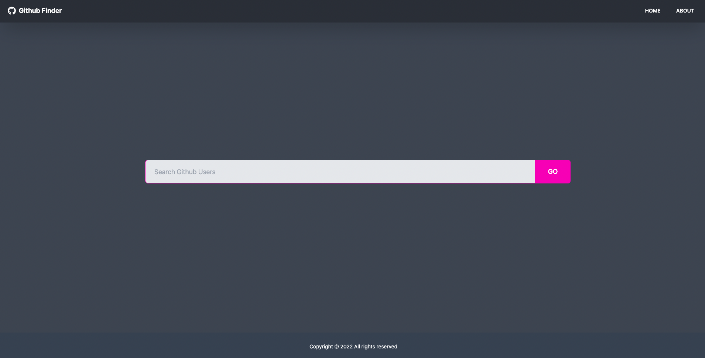
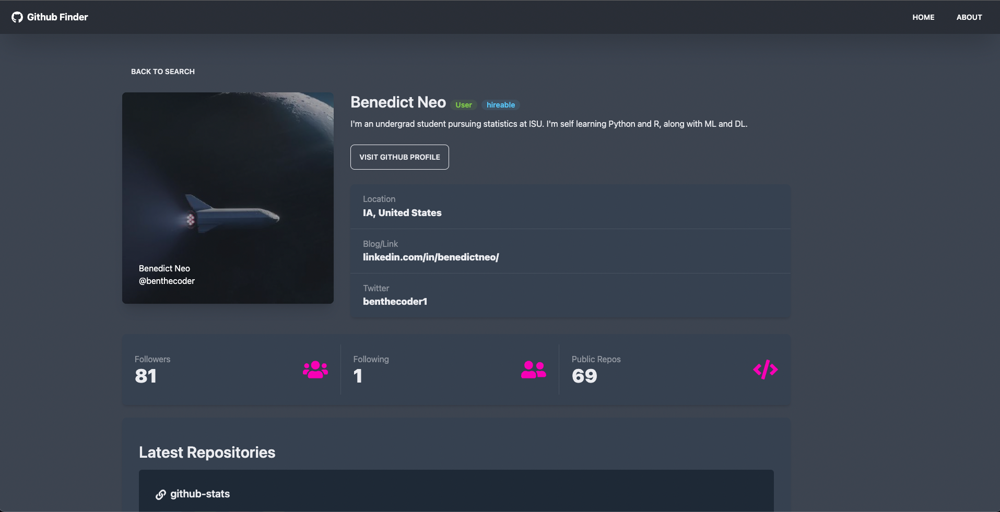

# Github Finder App

This project was bootstrapped with [Create React App](https://github.com/facebook/create-react-app).

This is a app built with React that allows users to search for Github users and returns a dashboard that includes the following user statistics

- hireable status
- bio
- location
- blog link
- twitter
- no. of followers
- no. following
- no. of public repositories
- latest repositories sorted by when it was last committed and limited to the top 20

## Images of the app

### Homepage with search bar

### User Results from search

The query was "benedict"

### User Dashboard

In the project directory, you can run:

## Run locally

### `npm start`

Runs the app in the development mode.\
Open [http://localhost:3000](http://localhost:3000) to view it in your browser.
